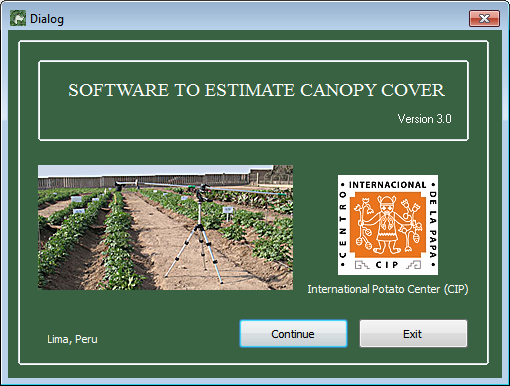
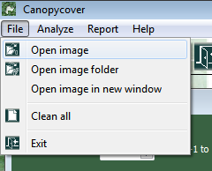
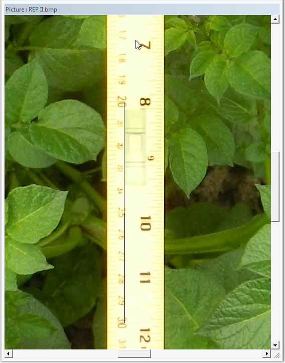
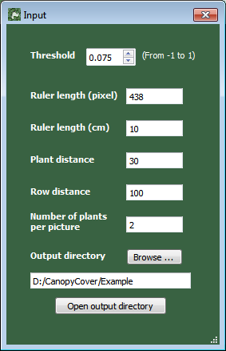
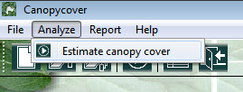
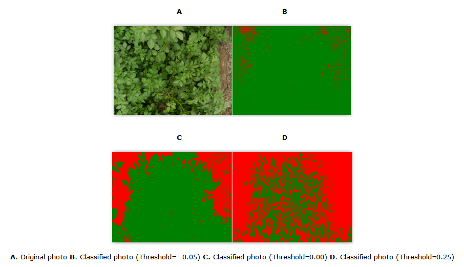
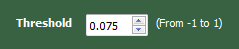
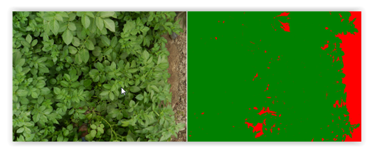
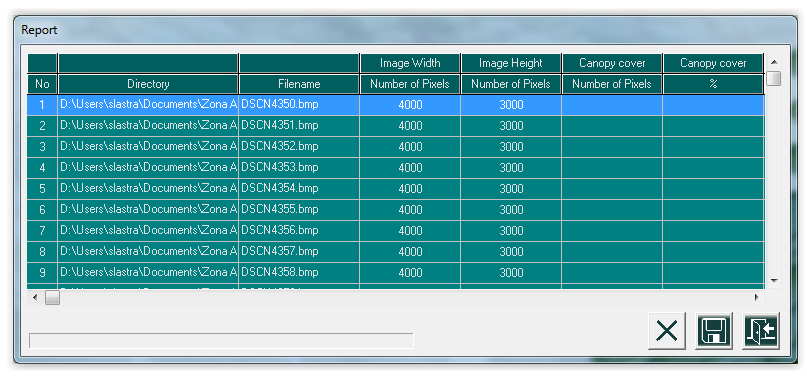
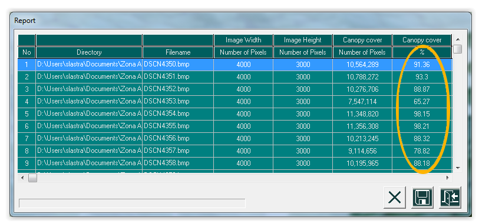

## User guide : Canopy Cover
### Software to estimate the percentage of canopy cover

##### Introduction

Canopy cover estimation is important in the study of the aerial plant growth. Recent applications of photography in this field facilitate obtaining temporal and spatial measurements of canopy cover. 

Vertical digital photographs taken following a [suitable protocol](http://www.cipotato.org/publications/pdf/006092.pdf) are normally processed using techniques of digital image processing.

In this application, a simple segmentation algorithm, based on a vegetation index in the visible region of the spectrum and a threshold value is applied to discriminate healthy green vegetation and other elements of the image.

Both the software used with the recommended protocol, allowing temporal assessment of canopy cover. The algorithm does not require training regions, which simplifies the process for the user.

Here is a description of how to use the program.

System minimum requirements

- Pentium PC, 512 MB RAM 
- Monitor SVGA, 256 colors 
- 1024x768 display resolution 
- Windows XP, 7 and 8 

##### Setting the scale 

1. Prior to calculating the area (cm2) covered by leaves it is necessary to define the scale of your photos. To do that, first it is necessary to load an image with a ruler or scale. 

	Go to Image menu -> Open image

    
    
2. A new window with the selected photo will appear. Use the sidebars to locate the ruler in the picture. Consider to use pictures with a ruler located at the center of the image, to avoid deformation and to get a better estimation of the scale value. 

3. Drag the mouse pointer to select a known distance on the ruler. Press the mouse button on the starting position and then release it at the ending position. The value of the number of pixels will appear in the upper side of the form. 

4. Enter the distance value in centimeters on the top of the form.

    

Note: Considering that photos obtained in the field may include inadvertent human  errors due to the variation in the height and angle of shot, it is recommendable to have an average scale value, you should repeat the previous process, record the obtained values and write the obtained mean on the top side of the form.

#####Classify an image based on a threshold

1. Open the image to be classified. 
   Go to Image menu -> Open image

2. Click button "Browse ..." and select the folder where the classified images will be recorded. 

3. In the "Input" form on the top-right side of the screen, complete the information of planting distance, and number of plants per photo, in addition to the scale value recently estimated.

	

4. To perform the classification, go to Analyze menu -> Estimate Canopy Cover 

	

#####Selecting the correct threshold

The value of the threshold could vary depending on the lighting conditions of the photograph. The normalized vegetation index we used goes from -1 to 1. Vegetation normally corresponds with positive values. 

As can be seen in the following figure, progressive increases in the threshold value result in lower areas classified as healthy green vegetation.

Negative or very close to zero threshold values, imply a less rigorous classification. In that case, more pixels will be recognized as part of the vegetation class. On the other hand, positive values are associated with a more rigorous classification. In that case, fewer areas will be recognized as part of the vegetation group.

To find the optimal threshold value, you should perform several classifications and evaluate the results visually until you agree with the results and the classification includes only the healthy green vegetation discarding senescent leaves, shadow areas, soil areas etc.

####Classifying a group of images 

1. If you have a group of photos taken under the same protocol, and lighting conditions, you have the option to perform a classification by groups. 

	To open a group of images, go to Image menu -> Open Image Folder

2. Select the folder that contains the images to be classified. A new window with the list of images to be processed will appear. 

	

3. Optionally, you can delete some pictures from the list using the (X) button at the bottom of the window

	 

4. Complete the form on the top of the screen with the information about scale value, planting density and the number of plants per photo. 

	

5. Go to Analyze menu ->Estimate Canopy Cover for classification.
 
	 

6. When the classification process finishes, the table will be filled with the results. Save the results as a text file (*.txt) using the diskette icon on the bottom of the screen. 

 

